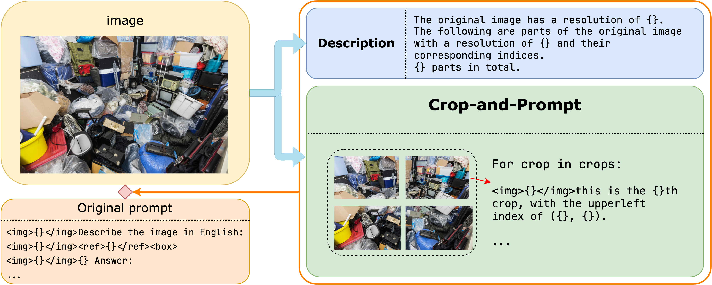

## Crop-and-Prompt for Qwen-VL
***
**Crop-and-Prompt** is a multi-image prompting method aiming at improving VLMs' performance on fine-grained perception tasks. It requires no pretraining or fine-tuning, and is portable on VLMs with support for multi-image inputs.

The Crop-and-Prompt module consists of two main components: a **cropping** mechanism and a **prompting** mechanism. The cropping mechanism is responsible for extracting fine-grained visual information from the input image by cropping an image into several crops of the same size, while the prompting mechanism is used to provide multiple views of the input image to the LVLM through a designed prompt structure that integrates the original image, cropped patches and textual prompts. The Crop-and-Prompt module is parameter-free and can be easily integrated into different existing LVLMs without additional computational cost.

The structure of the designed prompt:

    

See <a href="README_Qwen.md">README_Qwen</a> for more information.